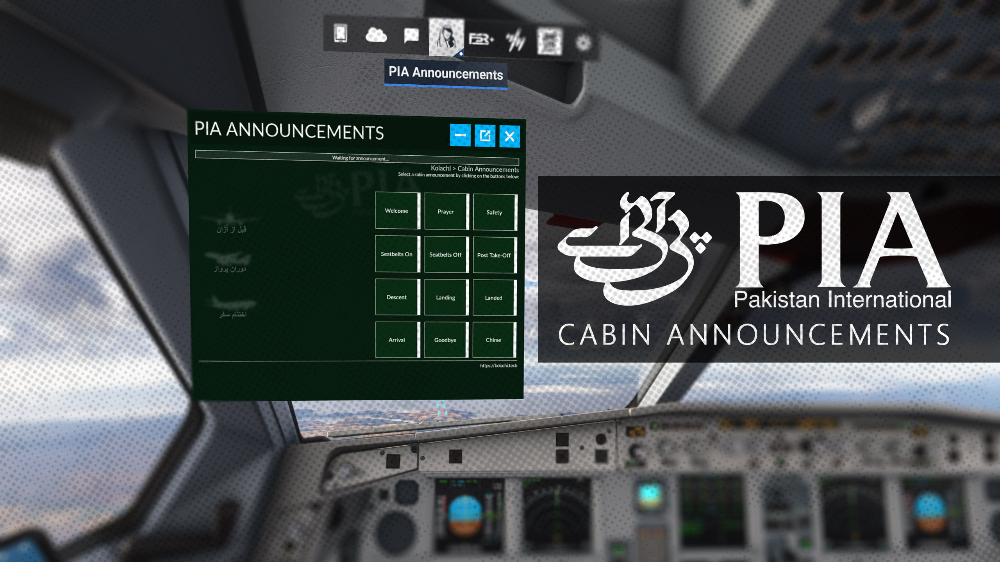
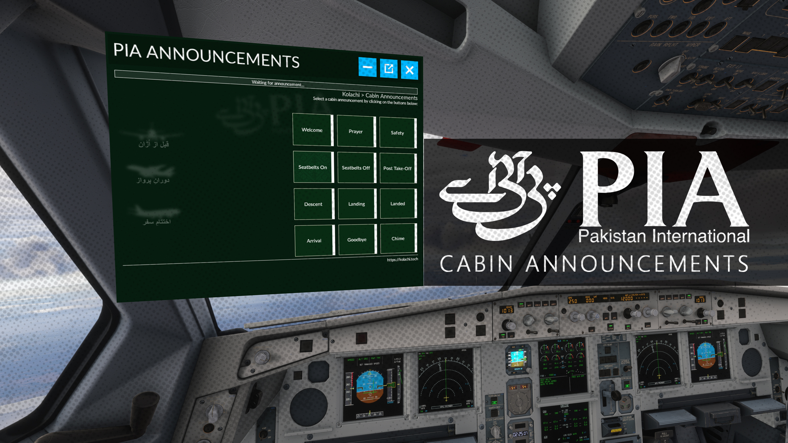
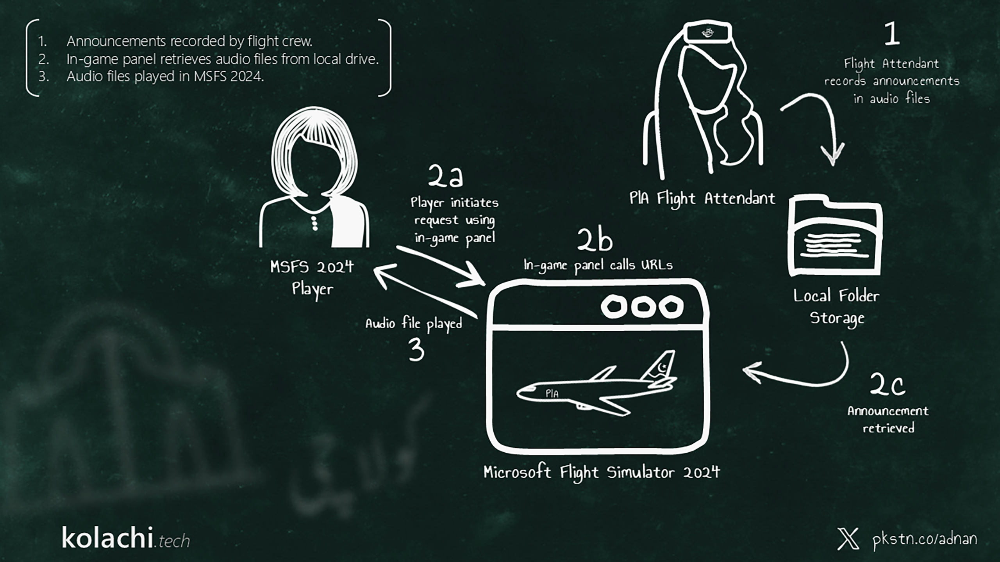

> [!NOTE]
> Declined by Flightsim.to but can still be downloaded from the GitHub URLs in the description.

[Flightsim.to] https://flightsim.to/addon/115481/ingame-panel-pia-announcements (May get deleted in future)

[PIA Announcements In-game Panel] https://github.com/kolachitech/kolachi/blob/main/downloads/pia-announcements/Kolachi_PIA-Announcements_Toolbar.zip

[PIA Announcements Companion App] https://github.com/kolachitech/kolachi/blob/main/downloads/pia-announcements/KolachiMSFS2024.zip

[PIA Announcements Audio] https://github.com/kolachitech/kolachi/blob/main/downloads/pia-announcements/Audio.zip

[Code] https://github.com/kolachitech/kolachi/tree/main/downloads/pia-announcements/code

---

*C# and JavaScript code generated by Codex/ChatGPT/GitHub Copilot*

*Some JavaScript code borrowed from 123flightSOUND: https://flightsim.to/addon/107318/123flightsound-elevate-your-simulation*

*Source code available from GitHub Repo*

# Setup Steps:
### 1) INSTALL:
a. Download and copy addon from above URL for 'Announcements Ingame Panel' and to MSFS 2024 'Community' folder.

b. Download and unzip files from URL tagged 'Announcements Companion App' into a single folder on your local drive.

c. Download and unzip audio files in the compressed file at the URL above for 'Announcements Audio'.

### 2) IMPLEMENT:
d. Go to the folder that has the unzipped files from step b, and open the 'appsettings.json' file. Paste the URL of the uncompressed audio files from step c. Make sure all back-slash ('\') characters are immediately preeded by an escape character (another back-slah). For example 'C:\Kolachi\Audio' would be 'C:\\Kolachi\\Audio' in the 'appsettings.json' file.

e. Run the 'KolachiMSFS2024.exe' file of the unzipped contents from step b above.

f. Open up your web browser and go to http://127.0.0.1:1947/health to make sure the companion app is running successfully.

### 3) INITIATE:
g. While operating an aircraft in MSFS 2024, go to the top panel bar to open the 'PIA Announcements' window, and click a button to play the audio.
